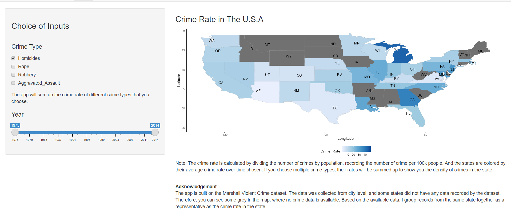
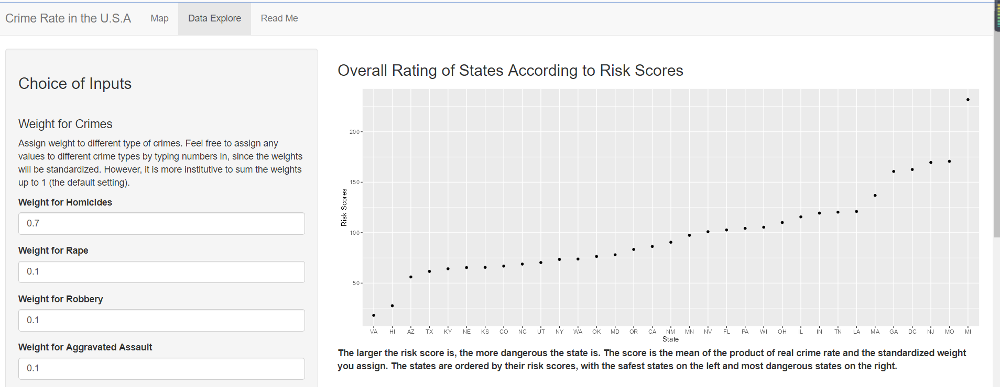
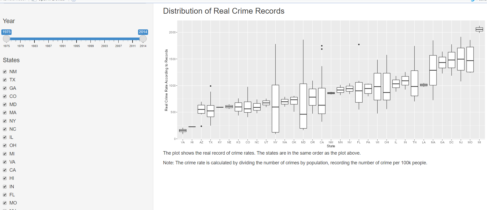

### The apps

If you are interested in the crime rate in the U.S.A, it is the app that helps you to discover that. In the "Map" page, you can visualize the geographical distribution of the crime rate by types and years. In the "Data Explore" page, you can assign weights to different crime types based on your personal concerns, to calculate your risk score for each state that has crime data recorded in the Marshall Violent Crime dataset.   

**Target of the app**

The app is made for people plan to visit the U.S.A so they can avoid dangerous places as their destination.
## Data

- https://data.world/carlvlewis/u-s-metro-areas-violent-crime-rates-by-type-1970-2015

- https://github.ubc.ca/ubc-mds-2017/DSCI_532_milestone1_qyue2014/tree/master/data/marshall

The Marshall Violent Crime dataset is used to build the app. More details about the dataset can be found [here](https://github.ubc.ca/ubc-mds-2017/DSCI_532_milestone1_qyue2014/tree/master/data/marshall). I used
the data in `maps` package in R to draw the map of the United States. Moreover, I use information provided in the
[Wikipedia](https://en.wikipedia.org/wiki/List_of_states_and_territories_of_the_United_States) to create the file "states_abbr.csv" in the data folder.

## Project screenshot

### Crime Rate in The U.S.A

Note: The crime rate is calculated by dividing the number of crimes by population, recording the number of crime per 100k people. And the states are colored by their average crime rate over time chosen. If you choose multiple crime types, their rates will be summed up to show you the density of crimes in the state.

The app is built on the Marshall Violent Crime dataset. The data was collected from city level, and some states did not have any data recorded by the dataset. Therefore, you can see some grey in the map, where no crime data is available. Based on the available data, I group records from the same state together as a representative as the crime rate in the state.

### Overall Rating of States According to Risk Scores

The larger the risk score is, the more dangerous the state is. The score is the mean of the product of real crime rate and the standardized weight you assign. The states are ordered by their risk scores, with the safest states on the left and most dangerous states on the right.

### Distribution of Real Crime Records

The plot shows the real record of crime rates. The states are in the same order as the plot above.

Note: The crime rate is calculated by dividing the number of crimes by population, recording the number of crime per 100k people.